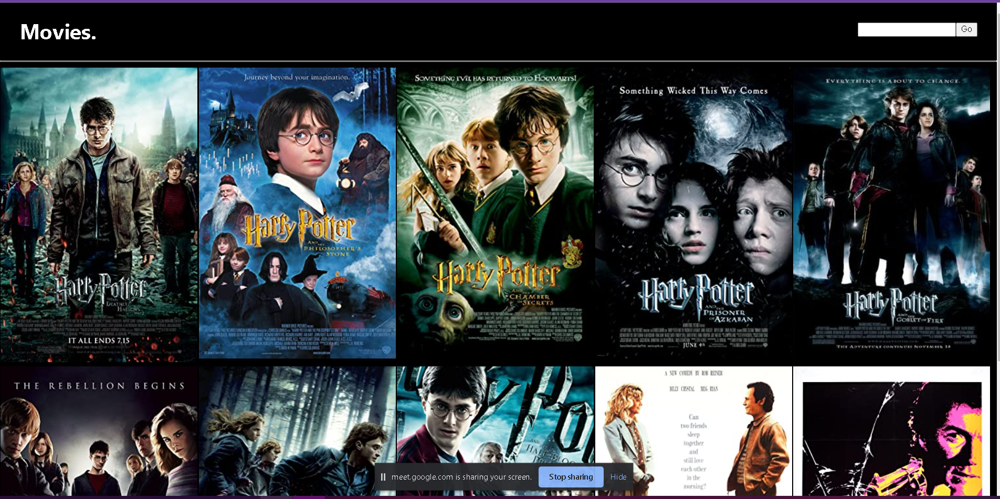
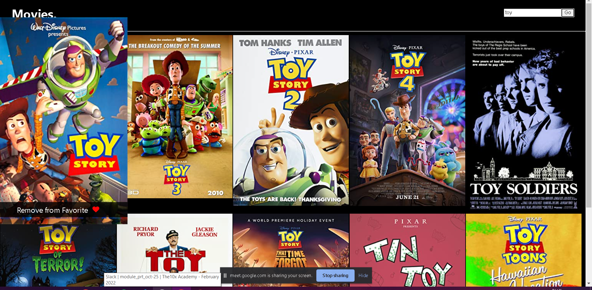
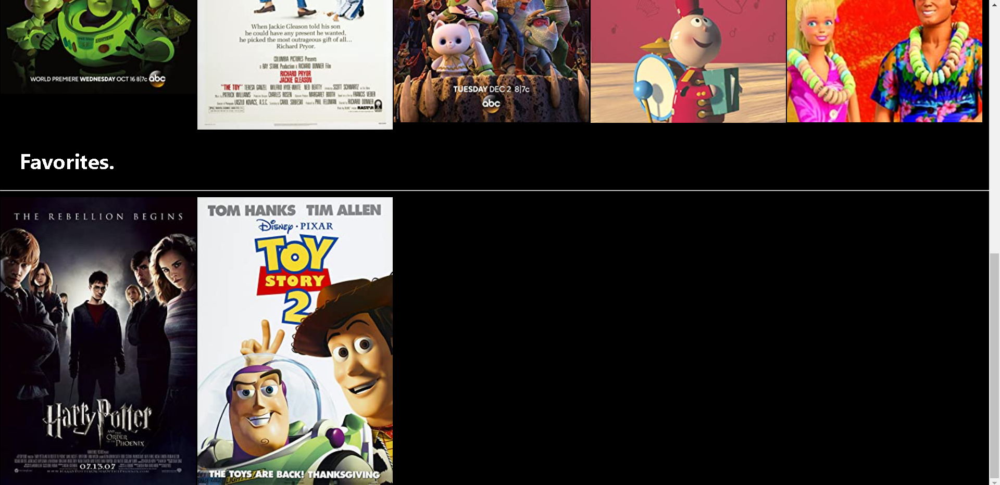
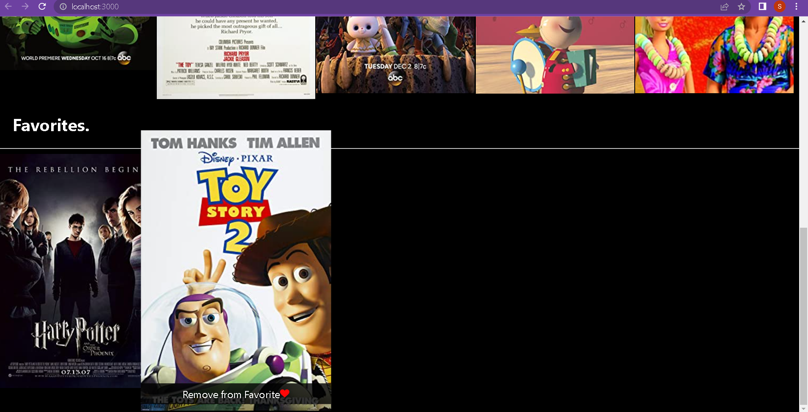

# Card Details Project
- One can see few default movies when you visit our site
- One can add you favorite movies to your favorites.
- One can also remove your favorite movies from your favorites.
- One can search for a movie .

## Technologies Used
- FrontEnd : ReactJS
- Frontend Deployment : Netlify app

## How To run
- clone the repository
- go to project folder in terminal
- npm install
- npm start

## Design

